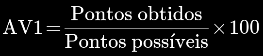
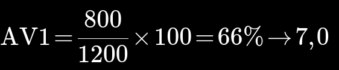

# ORIENTAÇÕES GERAIS 2024.1

___

Olá, eu sou o professor __Edson Melo de Souza__ (<souzaem@uni9.pro.br>).

Abaixo estão algumas orientações sobre critérios de avaliação, dicas de sites para cursos, materiais de apoio, exemplos etc.

## 1. Critérios de Avaliação

Ao longo do semestre, estão programadas entre dez (10) e doze (12) atividades, cada uma avaliada em 100 pontos, que serão conduzidas de maneira contínua, durante as aulas.

__As atividades serão compostas por questões relacionadas a disciplina e a conhecimentos gerais como tecnologia, política, economia, entre outras.__

A pontuação final de cada atividade corresponderá à porcentagem de pontos obtidos em relação aos 100 pontos possíveis. Por exemplo, se um aluno alcançar 80 pontos em uma atividade, sua nota será de 80%.

Essas atividades englobarão uma variedade de formatos, como questões objetivas de múltipla escolha, dissertativas e a elaboração de códigos práticos.

__É importante ressaltar que todas as atividades serão de natureza individual__, permitindo uma avaliação contínua do progresso de cada aluno, considerando a diversidade de dificuldades apresentadas por cada uma delas. A entrega das atividades deverá ser realizada exclusivamente por meio da plataforma Google Classroom da turma ao término de cada aula.

__A ENTREGA DA ATIVIDADE, MARCADA COMO CONCLUÍDA, CONTARÁ COMO PRESENÇA__.

Desta forma, a nota __AV1__ será calculada de acordo com a seguinte fórmula:

**Exemplo**:  Supondo que tenham sido aplicadas 12 atividades, e que o aluno tenha realizado 8 com pontuação máxima de 100 pontos, a nota final será:

Após a correção e atribuição de nota (com um máximo de 100 pontos para cada atividade), o Google Classroom realizará automaticamente o cálculo de uma nota final consolidada, a qual será posteriormente registrada na Central do Aluno como AV1 ao término do semestre.

É crucial ressaltar que a nota final será derivada exclusivamente das atividades entregues, não sendo influenciada pela presença nas aulas. Assim, a avaliação final será determinada pela quantidade de atividades concluídas, não pela quantidade de aulas frequentadas. Além disso, ao importar as notas para o sistema, estas serão arredondadas para o próximo valor superior, com incrementos de meio em meio ponto. A título de exemplo:

* 6,1 = 6,5
* 6,3 = 6,5
* 6,6 = 7,0

## __ATENÇÃO__

* __Não será possível realizar recuperação__ para atividades não executadas e entregues durante a aula, a menos que o aluno apresente um atestado de saúde aceito pela instituição. Nestes casos, será programada uma avaliação substitutiva ao final do semestre (formato de prova).

* A ausência em sala de aula devido a compromissos profissionais, reuniões ou qualquer outra razão não relacionada à saúde não será considerada justificativa para a não entrega da atividade. Nessas circunstâncias, o aluno será atribuído com nota zero para a respectiva atividade, além do registro da falta na Central do Aluno.

* Eventuais imprevistos, como greves no transporte público ou condições climáticas adversas, serão abordados individualmente para garantir uma solução apropriada, visando não prejudicar o aluno. Ou seja, em caso de imprevistos, a atividade será reprogramada para a próxima aula, sem a contabilização de falta.

## 2. Materiais de Apoio

Com o intuito de otimizar o processo de aprendizagem e garantir um suporte eficaz, os materiais didáticos serão progressivamente disponibilizados no Google Classroom, acompanhando o desenvolvimento das aulas ao longo do semestre.

Esses recursos essenciais serão apresentados de maneira organizada e sequencial, permitindo que os alunos acompanhem o conteúdo de forma eficiente e consistente. Cada material estará diretamente relacionado ao tema abordado em sala de aula na respectiva semana, estabelecendo uma ligação direta entre teoria e prática.

As vantagens dessa abordagem são notáveis. Primeiramente, proporciona a oportunidade de revisitar o conteúdo ministrado em sala, fortalecendo os conceitos aprendidos e esclarecendo possíveis dúvidas. Além disso, os materiais de apoio se tornarão ferramentas valiosas para aprofundar o conhecimento, ampliando a compreensão dos temas tratados e estimulando a pesquisa e o estudo autônomo.

Esses recursos estarão disponíveis ao longo do semestre, alinhados ao cronograma das aulas. Dessa maneira, os alunos poderão acessá-los de forma progressiva, conforme avançamos no programa da disciplina. Essa abordagem visa proporcionar uma experiência de aprendizado fluida e consistente, permitindo a assimilação gradual do conteúdo.

É crucial destacar que os materiais disponibilizados no Google Classroom complementarão as aulas presenciais ou telepresenciais, oferecendo uma visão mais abrangente e aprofundada dos temas estudados. Nesse sentido, incentivamos ativamente a utilização desses recursos para enriquecer a formação acadêmica dos alunos e favorecer o desenvolvimento das habilidades necessárias para seu crescimento profissional.

## 3. Dúvidas e Contato

Com o objetivo de simplificar a comunicação e esclarecer dúvidas ao longo do semestre, incentivamos o uso das ferramentas de contato disponíveis no Google Classroom. Isso possibilita que as mensagens sejam registradas e respondidas mesmo fora do dia da aula, estabelecendo um canal eficiente para o diálogo contínuo. Além disso, oferecemos orientações e auxílio conforme necessário para otimizar sua experiência no curso. Acreditamos que essa interação constante será fundamental para o seu progresso acadêmico e para a construção de um ambiente propício ao aprendizado.

Sinta-se à vontade para entrar em contato sempre que precisar de esclarecimentos ou tiver sugestões para aprimorar o conteúdo e a dinâmica das aulas. Sua participação é valiosa e contribuirá para a melhoria do processo de ensino-aprendizagem. Contamos com o seu engajamento e disposição para aproveitar ao máximo esta oportunidade de aprendizado. Juntos, tornaremos este semestre uma experiência enriquecedora e proveitosa para todos.

Estou ansioso para auxiliar em sua jornada acadêmica e espero contar com uma comunicação aberta e eficiente ao longo do semestre.

## 4. Links Interessantes

* [Youtube (Edson M. Souza)](https://youtu.be/aqErh3MlJsE) - Tutorial Github
* [School of Net](https://www.schoolofnet.com/curso/git/controle-de-versao/git-e-github/) - Controle de versão (Github)
* [Programação](https://www.w3schools.com/) - Cursos para diversas linguagens de programação
* [Ciência de Dados](https://www.datascienceacademy.com.br/cursosgratuitos) - Cursos de Ciência de Dados gratuitos e com certificado

## 5. Bibliografia

Você pode acessar milhares de _e-books_, artigos e livros completos na biblioteca virtual da universidade, através da Central do Aluno.

Durante as aulas os materiais bibliográficos específicos serão informados.

## 6. Curso de Inglês

Da mesma forma que você pode acessar diversos materiais de forma gratuita através da Central do Aluno, também está disponível um curso de inglês da plataforma Voxy.
